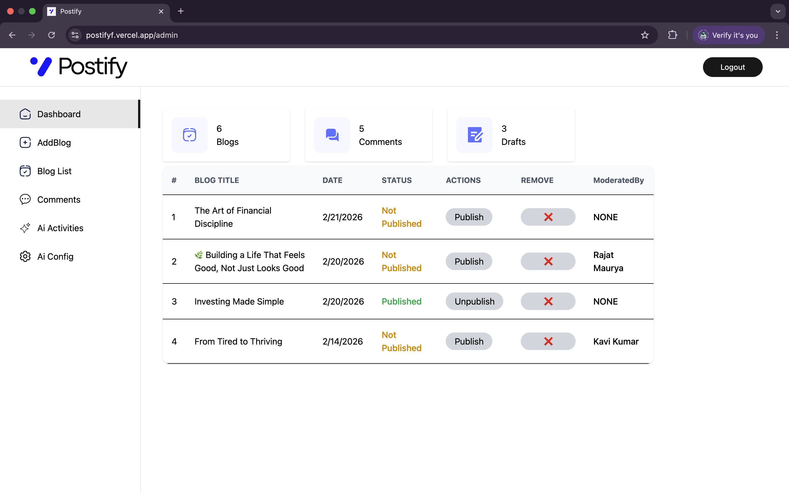
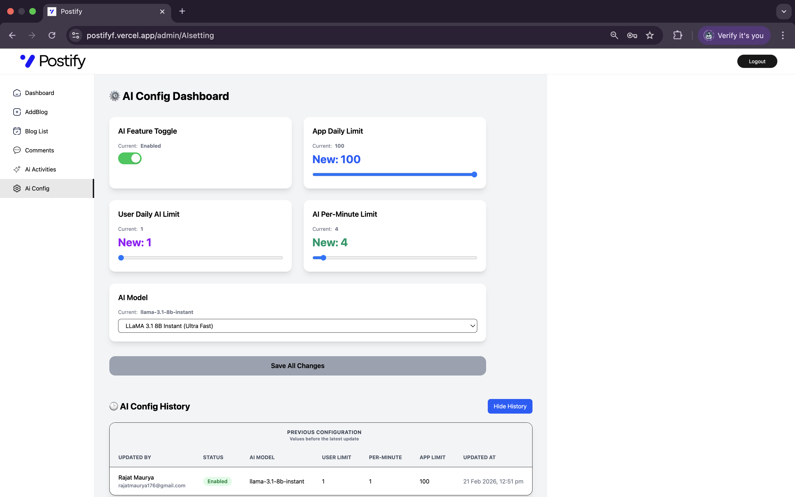
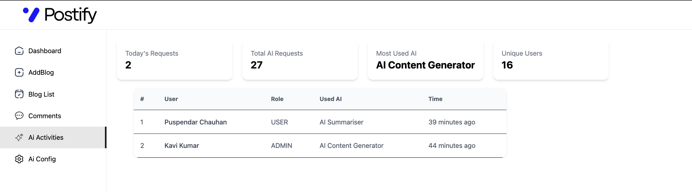
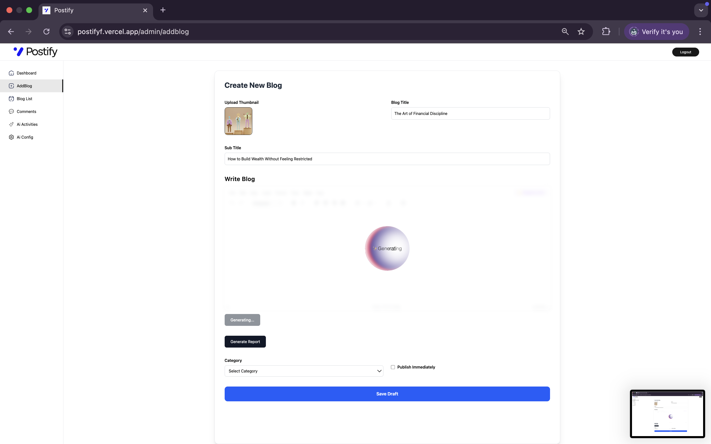
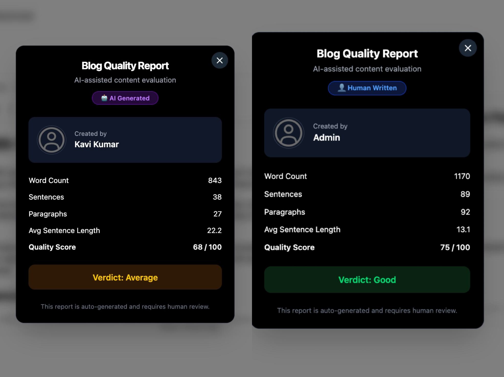
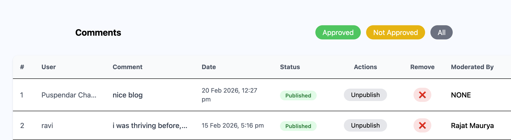
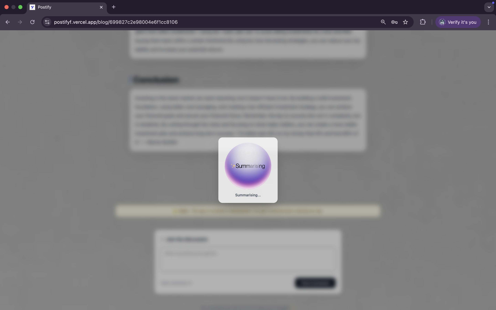
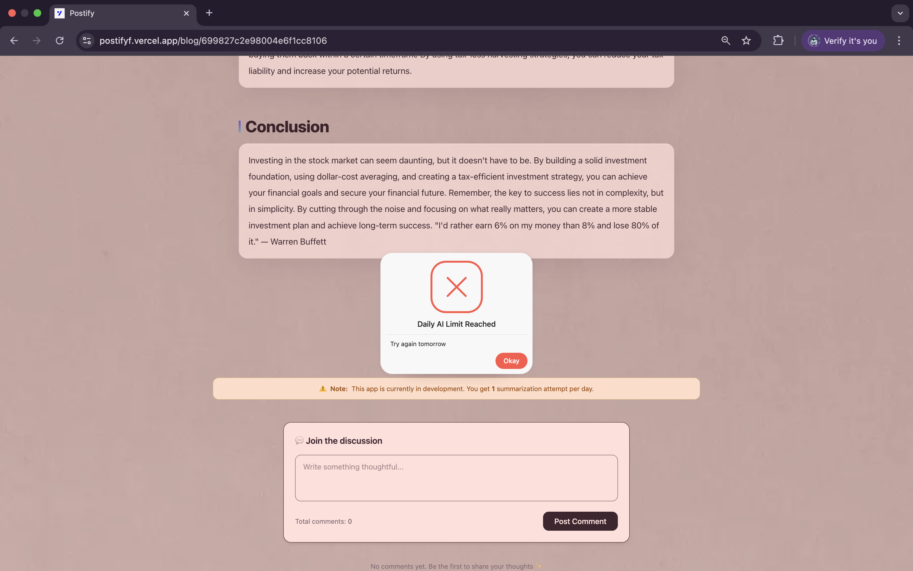

## 🚀 Postify – AI-Powered Blogging Platform


Postify is a production-grade, AI-powered blogging platform built with the MERN stack and deployed on Vercel. It focuses on performance, security, scalability, and advanced AI features such as content generation, summarization, moderation, and analytics.


## 🌐 Live Demo: https://postifyf.vercel.app


## ✨ Features at a Glance

- 🧠 AI blog generation & one-click summarization  
- 🔐 Secure authentication (Google OAuth, OTP, JWT with rotation)  
- 🛡 Role-based Admin Dashboard with full audit logs  
- 💬 Two-layer AI + rule-based comment moderation  
- 📊 AI usage analytics & activity tracking.  
- ⚙️ AI configuration panel (models, limits, toggles)  
- 🚦 Redis-based rate limiting, cooldowns & abuse protection  
- ⚡ High-performance UI with caching, lazy loading & CDN media  


##  📸 Project Glimpse

### 🛠 Admin Dashboard


### ⚙️ AI Configuration Panel


### ⚙️ AI Activities Panel



### 📝 Add Blog + AI Generation


### 📊 Blog Quality Report


### 💬 Comments Moderation


### 🧠 Blog Summarisation


### 🚫 Daily AI Limit Reached



## 🛠 Tech Stack

Frontend: React, Tailwind CSS, React Query


Backend: Node.js, Express.js

Database: MongoDB

Caching & Rate Limiting: Redis

Authentication: JWT (Access + Refresh Tokens), Google OAuth, OTP

AI: AI APIs for content generation, summarization, moderation,
and reports

Media: ImageKit CDN

Deployment: Vercel


## 🔐 Secure Authentication

Google OAuth + OTP verification

JWT access & refresh tokens with rotation

HTTP-only cookies

Redis-based token blacklisting

## 🧠 AI-Powered Features

AI blog generation

One-click blog summarization

Automated content quality reports (word, sentence, paragraph
 counts, quality score)

Two-layer comment moderation (rule-based + AI) to filter 
abusive, spam, and unsafe content

## 🛡 Admin Dashboard

Role-based access control

Blog publishing & draft management

Comment moderation

Full audit history of admin actions

## 📊 AI Usage Analytics

Track daily requests and total usage

Most-used features

Per-user activity logs

## ⚙️ AI Configuration Panel

Toggle AI features

Switch AI models

Enforce per-user and global daily limits

## 🚦 Security & Abuse Prevention

Redis-based rate limiting

Cooldowns and OTP throttling

Protection against spam, abuse, and burst AI requests

## ⚡ Performance Optimizations

ImageKit CDN for media delivery

Client-side caching with React Query

Lazy loading

Efficient REST API design

## 🗄 Scalable Data Models

Users

Blogs

Comments

AI Usage

AI Logs

Config History

Tokens

Moderation Audit Trails


## 🏗 Architecture Overview

Frontend (React) communicates with Backend (Express REST APIs)
MongoDB stores application data
Redis handles caching, rate limiting, and token blacklisting
AI APIs power content generation, summarization, moderation, and reports
ImageKit CDN optimizes media delivery
Vercel hosts and deploys the application


```
⚙️ Getting Started (Local Setup)

1️⃣ Clone the repository


git clone https://github.com/rajatmaurya-cs/


Postify-AI-Powered-Blogging-Platform.git


cd Postify

2️⃣ Setup Backend


cd backend


npm install

3️⃣ Setup Frontend


cd frontend


npm install
```
## 🔑 Environment Variables

Create a .env file in the backend and configure.

GOOGLE_CLIENT_SECRET
GOOGLE_CLIENT_ID

FRONTEND_URL

BREVO_FROM_NAME. 


BREVO_FROM_EMAIL


BREVO_SMTP_PASS


BREVO_SMTP_USER


BREVO_SMTP_PORT


BREVO_SMTP_HOST


FROM_EMAIL

REFRESH_TOKEN_SECRET


ACCESS_TOKEN_SECRET

MONGODB_URL

IMAGEKIT_URL_ENDPOINT


IMAGEKIT_PRIVATE_KEY


IMAGEKIT_PUBLIC_KEY

EMAIL_USER


REDIS_URL


NODE_ENV


GEMINI_API_KEY


GROQ_API_KEY

Create a .env file in the Fronted and configure.

VITE_GOOGLE_CLIENT_ID


VITE_API_BASE_URL


VITE_TINYMCE_KEY


## 👨‍💻 Author

## Rajat Maurya

🌐 Portfolio: https://rajat-dev.vercel.app/

🎓 B.Tech Computer Science, KIET Group of Institutions

Focused on building production-grade, scalable, AI-powered web applications.


